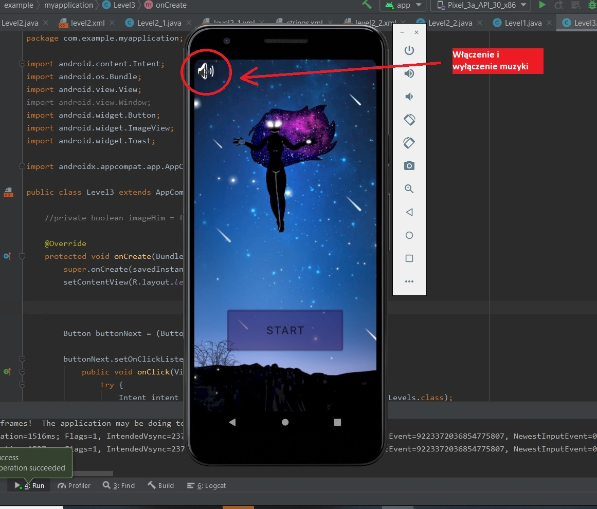
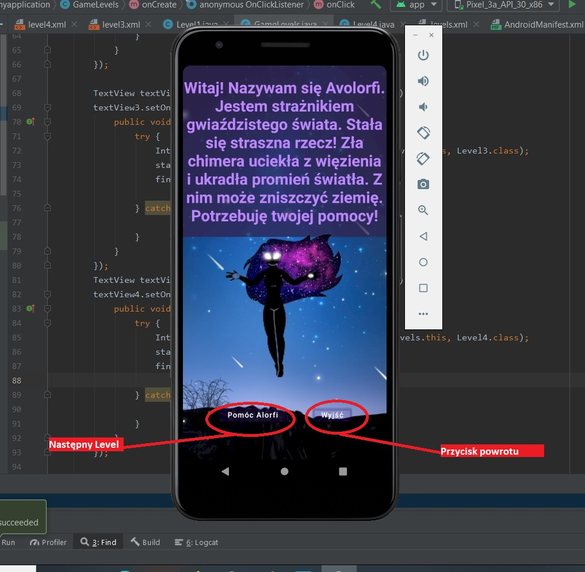
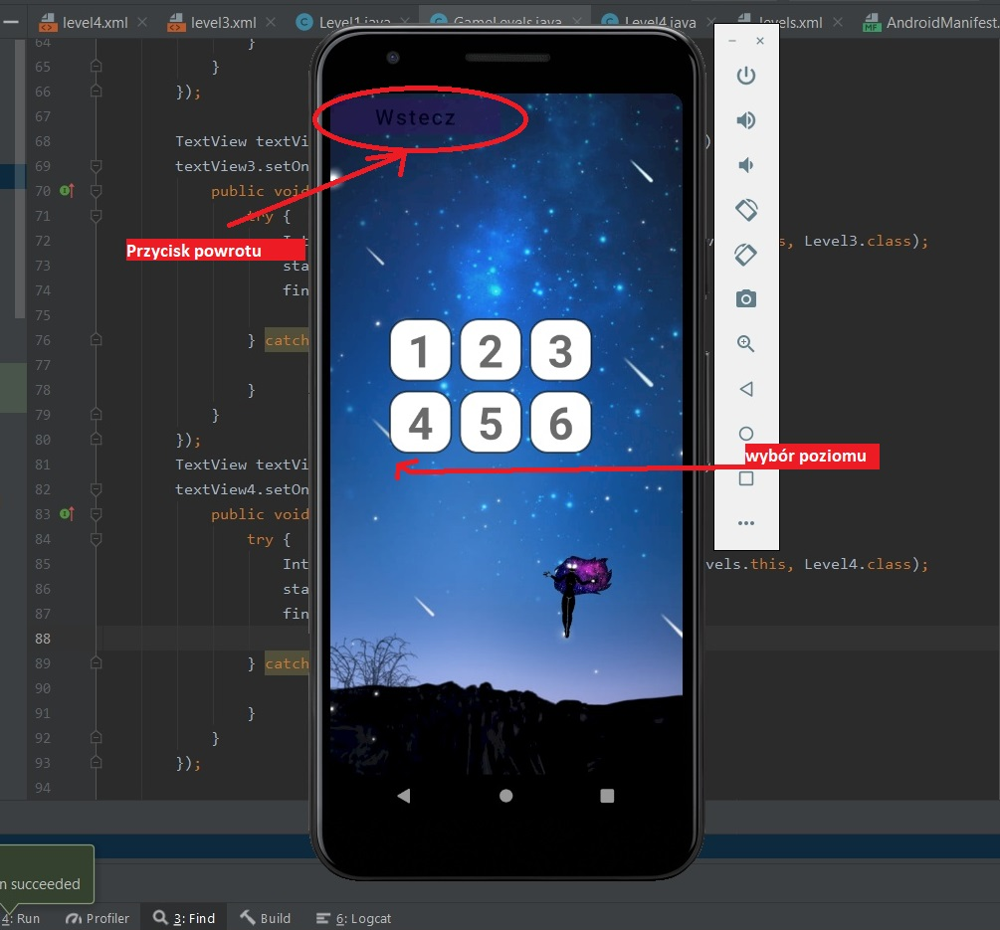
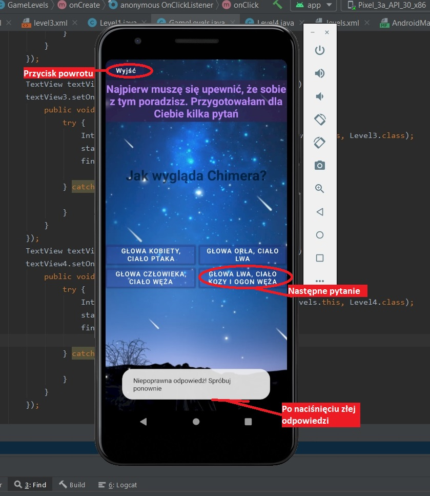
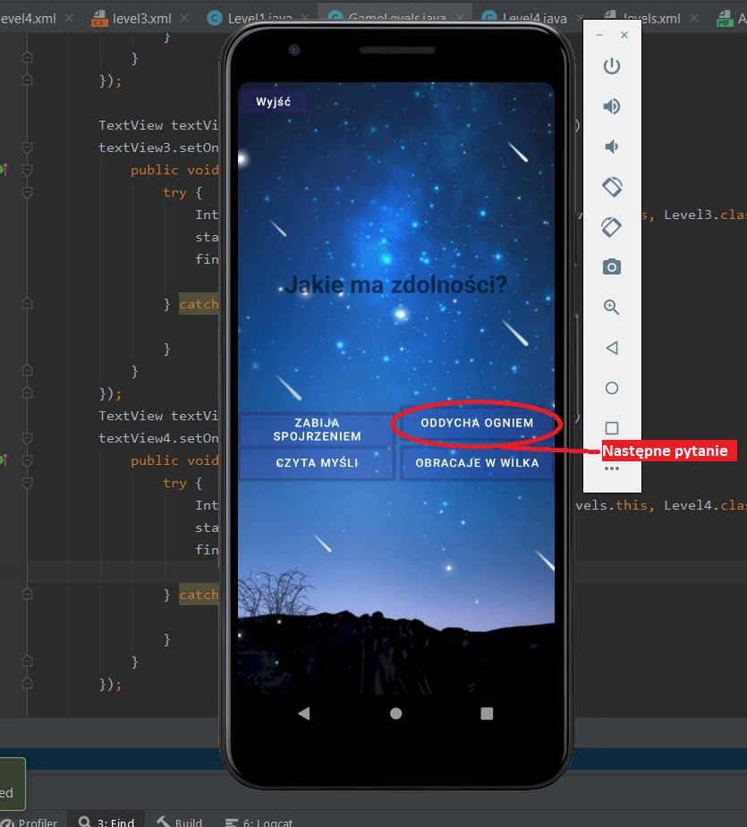
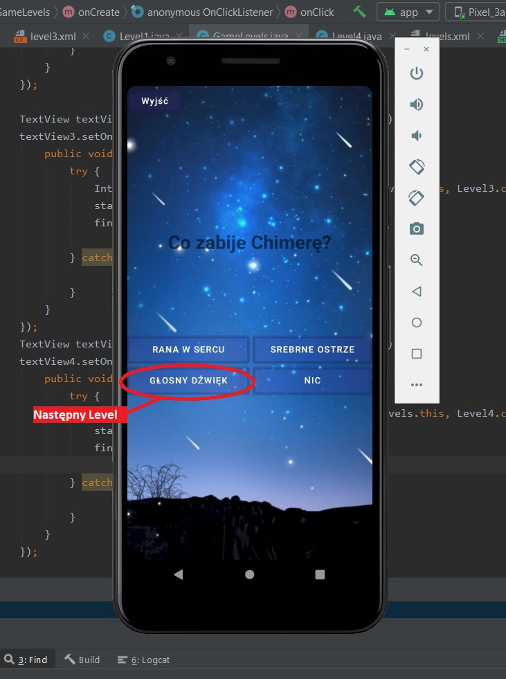
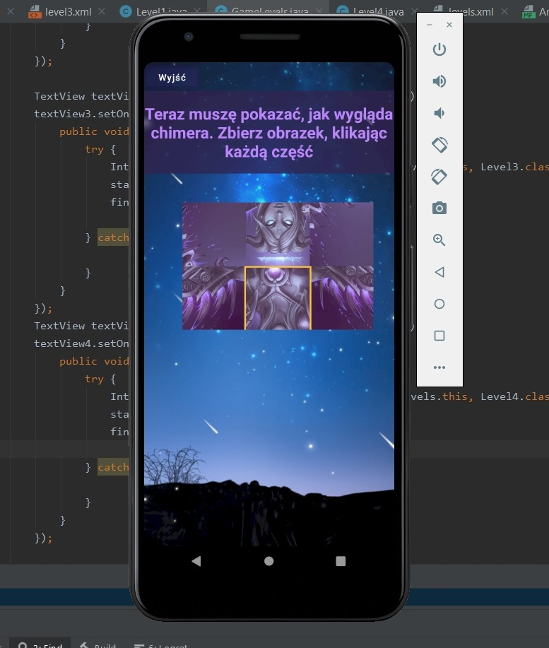
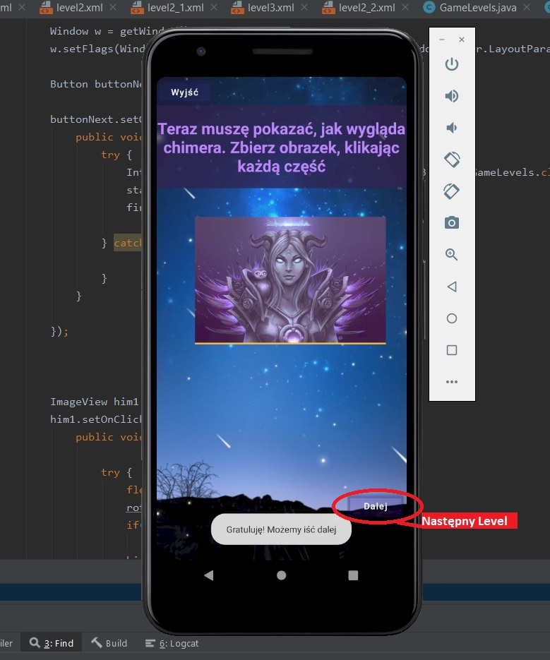
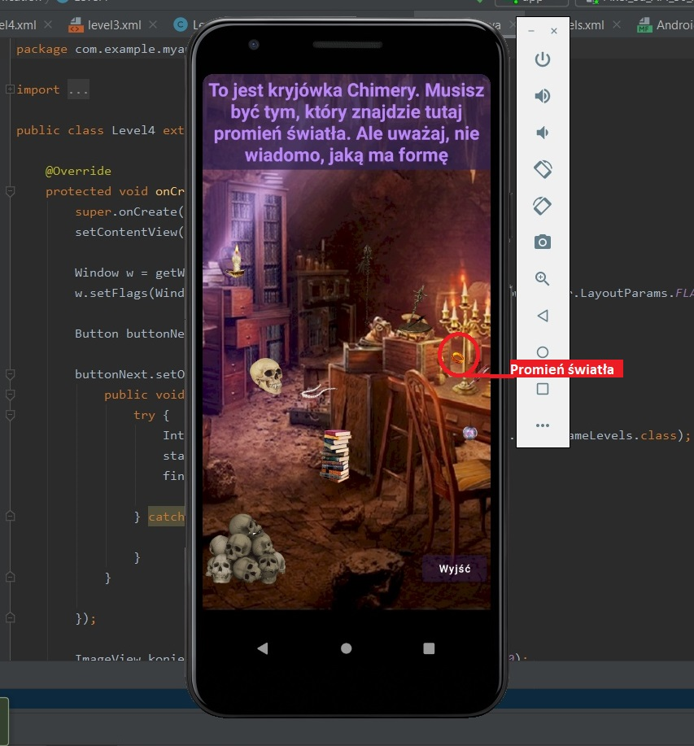
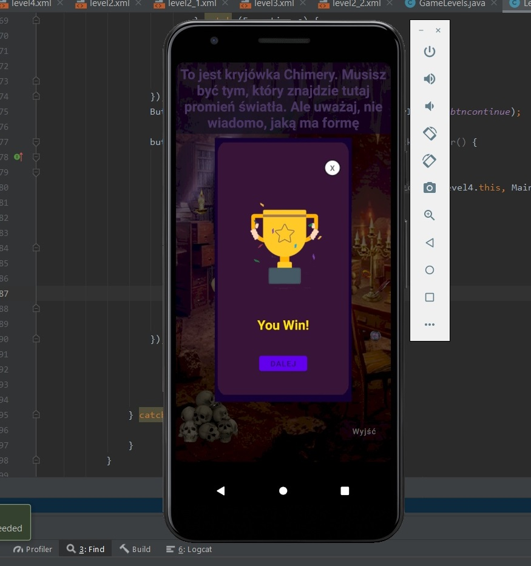

# Avolorfi

## Projekt zaliczeniowy przedmiotu Programowanie aplikacji mobilnych - Gra Mobilna
> Celem gry jest pomoc Avolorfi w odnalezieniu promienia światła, aby to zrobić, musimy wykonać zadania

### Gra zawierajaca: 
* Quizy
* Puzzle
* Wyszukiwane przedmtów

#### Wszyscy strony zawiera funkcją rozciągania gry na caly ekran
``
Window w = getWindow();
w.setFlags(WindowManager.LayoutParams.FLAG_FULLSCREEN, WindowManager.LayoutParams.FLAG_FULLSCREEN);
``

### Strona startowa
#### Zawiera przycisk włączenia i wyłączenia muzyki i Przycisk starta gry

#### Funkcja włączenia i wyłaczenia muzyki
``
MediaPlayer mediaPlayer = MediaPlayer.create(this, R.raw.faith);

Button buttonZwuk = (Button) findViewById(R.id.buttonZwuk);
buttonZwuk.setOnClickListener(new View.OnClickListener() {
public void onClick(View v) {
try {
if(isPlaying){
mediaPlayer.pause();
isPlaying = false;
}else {
mediaPlayer.start();
isPlaying = true;
}

} catch (Exception e) {

}
}
});

``
#### Funkcja przyciska start
``
Button buttonStart = (Button) findViewById(R.id.buttonStart);

buttonStart.setOnClickListener(new View.OnClickListener() {
public void onClick(View v) {

try {
Intent intent = new Intent(MainActivity.this, GameLevels.class);
startActivity(intent);
finish();

} catch (Exception e) {

}
}

});

``

### Strona wybóra poziomu gry 
#### Zawiera przycisk powrótu i przyciski do levela
#### 1 - strona Level1
#### 2 - strona Level2
#### 3 - strona Level3
#### 4 - strona Level4

#### Zawiera przycisk włączenia i wyłączenia muzyki. 

## 4 level

``
ImageView him1 = (ImageView) findViewById(R.id.him1);
him1.setOnClickListener(new View.OnClickListener() {
public void onClick(View v) {

try {
float rot=him1.getRotation();
rot=rot+90;
if(rot==360)
rot=0;
him1.setRotation(rot);
// Toast.makeText(Level3.this, "pos:"+him1.getRotation(), Toast.LENGTH_SHORT).show();

if (check_pic()) //
Toast.makeText(Level3.this, "Gratuluję! Możemy iść dalej", Toast.LENGTH_SHORT).show();
Button buttonD = (Button) findViewById(R.id.next);

buttonD.setOnClickListener(new View.OnClickListener() {
public void onClick(View v) {
try {
Intent intent = new Intent(Level3.this, Level4.class);
startActivity(intent);
finish();

} catch (Exception e) {

}
}

});

} catch (Exception e) {

}
}
});
ImageView him2 = (ImageView) findViewById(R.id.him2);
him2.setOnClickListener(new View.OnClickListener() {
public void onClick(View v) {

try {
float rot=him2.getRotation();
rot=rot+90;
if(rot==360)
rot=0;
him2.setRotation(rot);
// Toast.makeText(Level3.this, "pos:"+him2.getRotation(), Toast.LENGTH_SHORT).show();

if (check_pic()) //
Toast.makeText(Level3.this, "Gratuluję! Możemy iść dalej", Toast.LENGTH_SHORT).show();
Button buttonD = (Button) findViewById(R.id.next);

buttonD.setOnClickListener(new View.OnClickListener() {
public void onClick(View v) {
try {
Intent intent = new Intent(Level3.this, Level4.class);
startActivity(intent);
finish();

} catch (Exception e) {

}
}

});

} catch (Exception e) {

}
}
});
ImageView him3 = (ImageView) findViewById(R.id.him3);
him3.setOnClickListener(new View.OnClickListener() {
public void onClick(View v) {

try {
float rot=him3.getRotation();
rot=rot+90;
if(rot==360)
rot=0;
him3.setRotation(rot);
// Toast.makeText(Level3.this, "pos:"+him3.getRotation(), Toast.LENGTH_SHORT).show();

if (check_pic()) //
Toast.makeText(Level3.this, "Gratuluję! Możemy iść dalej", Toast.LENGTH_SHORT).show();
Button buttonD = (Button) findViewById(R.id.next);

buttonD.setOnClickListener(new View.OnClickListener() {
public void onClick(View v) {
try {
Intent intent = new Intent(Level3.this, Level4.class);
startActivity(intent);
finish();

} catch (Exception e) {

}
}

});

} catch (Exception e) {

}
}
});
ImageView him4 = (ImageView) findViewById(R.id.him4);
him4.setOnClickListener(new View.OnClickListener() {
public void onClick(View v) {

try {
float rot=him4.getRotation();
rot=rot+90;
if(rot==360)
rot=0;
him4.setRotation(rot);
//Toast.makeText(Level3.this, "pos:"+him4.getRotation(), Toast.LENGTH_SHORT).show();

if (check_pic()) //
Toast.makeText(Level3.this, "Gratuluję! Możemy iść dalej", Toast.LENGTH_SHORT).show();
Button buttonD = (Button) findViewById(R.id.next);

buttonD.setOnClickListener(new View.OnClickListener() {
public void onClick(View v) {
try {
Intent intent = new Intent(Level3.this, Level4.class);
startActivity(intent);
finish();

} catch (Exception e) {

}
}

});

} catch (Exception e) {

}
}
});
ImageView him5 = (ImageView) findViewById(R.id.him5);
him5.setOnClickListener(new View.OnClickListener() {
public
 
void onClick(View v) {

try {
float rot=him5.getRotation();
rot=rot+90;
if(rot==360)
rot=0;
him5.setRotation(rot);
//Toast.makeText(Level3.this, "pos:"+him5.getRotation(), Toast.LENGTH_SHORT).show();

if (check_pic()) //
Toast.makeText(Level3.this, "Gratuluję! Możemy iść dalej", Toast.LENGTH_SHORT).show();
Button buttonD = (Button) findViewById(R.id.next);

buttonD.setOnClickListener(new View.OnClickListener() {
public void onClick(View v) {
try {
Intent intent = new Intent(Level3.this, Level4.class);
startActivity(intent);
finish();

} catch (Exception e) {

}
}

});

} catch (Exception e) {

}
}
});
ImageView him6 = (ImageView) findViewById(R.id.him6);
him6.setOnClickListener(new View.OnClickListener() {
public void onClick(View v) {

try {
float rot=him6.getRotation();
rot=rot+90;
if(rot==360)
rot=0;
him6.setRotation(rot);
// Toast.makeText(Level3.this, "pos:"+him6.getRotation(), Toast.LENGTH_SHORT).show();

if (check_pic()) //
Toast.makeText(Level3.this, "Gratuluję! Możemy iść dalej", Toast.LENGTH_SHORT).show();
Button buttonD = (Button) findViewById(R.id.next);

buttonD.setOnClickListener(new View.OnClickListener() {
public void onClick(View v) {
try {
Intent intent = new Intent(Level3.this, Level4.class);
startActivity(intent);
finish();

} catch (Exception e) {

}
}

});

} catch (Exception e) {

}
}
});

}
public boolean check_pic(){
ImageView him1 = (ImageView) findViewById(R.id.him1);
ImageView him2 = (ImageView) findViewById(R.id.him2);
ImageView him3 = (ImageView) findViewById(R.id.him3);
ImageView him4 = (ImageView) findViewById(R.id.him4);
ImageView him5 = (ImageView) findViewById(R.id.him5);
ImageView him6 = (ImageView) findViewById(R.id.him6);
float rot1=him1.getRotation();
float rot2=him2.getRotation();
float rot3=him3.getRotation();
float rot4=him4.getRotation();
float rot5=him5.getRotation();
float rot6=him6.getRotation();

if(rot1==0 && rot2==0 && rot3==0 && rot4==0 && rot5==0 && rot6==0 )
return true;
else
return false;

}

``
